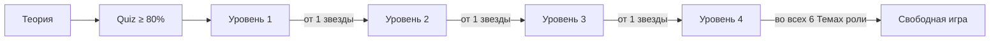

# Игровая прогрессия

## Две ролевые ветки

Пользователь проходит обучение отдельно как покупатель и как продавец. Звёзды и открытые уровни одной роли не переносятся в другую: безопасное поведение покупателя и продавца проверяется разными ситуациями.

Каждая ролевая ветка содержит шесть Тем. В каждой Теме Пользователь читает Теорию, проходит Quiz минимум на 80% и затем открывает четыре последовательных Уровня. Свободная игра остаётся отдельным режимом, а не пятым Уровнем.

## Уровни

| Уровень | Ответ пользователя | Собеседник | Назначение |
| --- | --- | --- | --- |
| 1 | Готовые, заметно различающиеся варианты | Полностью шаблонный сценарий | Познакомить с базовыми опасными признаками и безопасными действиями |
| 2 | Готовые, похожие по смыслу варианты | Полностью шаблонный сценарий | Научить выбирать безопасное действие без очевидной подсказки |
| 3 | Один готовый вариант, затем два свободных ответа | Реплики полностью задаёт Сценарий, evaluator только оценивает свободные ответы | Перейти от узнавания правильного варианта к самостоятельной формулировке |
| 4 | Только собственный текст | Модель ведёт разговор и всегда играет мошенника | Проверить навык в свободном диалоге без готовых ответов |

Первые два уровня полностью настраиваются через данные: реплики, варианты, реакции виртуального собеседника, баллы и объяснения не зашиваются в Go-код. Подготовленный Уровень 1 содержит три Шага сценария, Уровень 2 — два; каждый такой Шаг предлагает три варианта. Уровень 4 содержит пять последовательных `free_text`-Шагов, совпадающих с серверным пределом диалога.

В интерфейсе готовый вариант показывается как возможная реплика Пользователя от первого лица. Пользователь выбирает реплику в меню, проверяет формулировку и отправляет её отдельной кнопкой; это выбор текста Сообщения, а не абстрактного действия. Реплики различаются между Шагами сценария и отвечают на текущую фразу виртуального собеседника. На `free_text`-Шаге вместо вариантов показывается поле, в котором Пользователь пишет собственную реплику; на одном Шаге эти способы ответа не смешиваются.

Подготовленные L3-Сценарии состоят из первого Шага с готовыми вариантами и двух следующих Шагов только со свободным текстом. Второй свободный Ответ пользователя завершает Прохождение. Evaluator не генерирует Сообщения и не управляет переходами.

## Свободная игра

Свободная игра открывается отдельно для каждой роли после прохождения Уровня 4 хотя бы на одну Звезду во всех шести Темах этой роли.

GameState содержит Тему, Сценарий, Уровень, роли участников, типизированный `product_context`, текущий и общий номер Шага сценария, допустимый способ ответа, сохранённые Ответы пользователя и упорядоченную историю. Клиент отправляет актуальный `step_id`; устаревший Шаг получает `STALE_STEP`. `step_goal` остаётся внутренней инструкцией, интерфейс получает только `counterparty_message`.

При старте система выбирает тип собеседника: мошенник или обычный участник сделки. Выбор скрыт от пользователя и сохраняется на всё прохождение, чтобы поведение собеседника не менялось посреди разговора.

Одновременно сервер случайно выбирает один из разрешённых товарных контекстов соответствующей ролевой ветки, не повторяя предыдущий контекст того же Пользователя в текущем процессе, и закрепляет его за Прохождением. Поэтому новая Свободная игра посвящена другому товару или способу получения, но повторное открытие той же попытки не меняет предмет сделки. Стартовая фаза `hook` используется только для первой реплики; после каждого Ответа пользователя сервер последовательно переводит диалог в `escalation`, `critical_request` и `resolution`, поэтому собеседник не начинает разговор заново.

Режим не участвует в открытии уровней. Его задача — проверить, умеет ли пользователь отличать реальную угрозу от обычной сделки, а не просто отказываться от любого предложения.

## Баллы, звёзды и доступ

- Каждый вариант ответа получает оценку качества безопасного действия: 0, 25, 50, 75 или 100 сырых очков. Вариант не обязан быть полностью безопасным или полностью опасным.
- Итоговый Балл Прохождения — процент от максимума сырых очков всех его Шагов сценария, округлённый до ближайшего целого значения от 0 до 100; при значении ровно посередине применяется округление вверх.
- Количество звёзд определяется по результату: от одной до трёх для пройденного уровня, ноль — для непройденного.
- Следующий уровень открывается после одной звезды на предыдущем.
- В интерфейсе показывается лучший результат уровня.
- На карточке Темы круговой индикатор показывает количество пройденных Уровней из четырёх; на карточке отдельного Уровня показываются его Звёзды. На главной карточка тренировки показывает по одному кружку на каждый Уровень Темы: заполненный кружок означает Уровень, пройденный хотя бы на одну Звезду, контурный — ещё не пройденный Уровень.
- Повторная попытка не уменьшает уже полученные звёзды.
- Три звезды нужны для дополнительной мотивации и достижений, но не блокируют основной путь.
- Признак `is_locked` вычисляется из прогресса и возвращается клиенту; отдельным источником истины в БД он не хранится.
- Сервер отклоняет запуск закрытого уровня с `403 Forbidden`; клиентское отображение открытости не заменяет эту проверку.

Пользователь получает объяснения к отдельным Ответам пользователя и итоговый разбор только после завершения Прохождения. Во время управляемого Сценария система не раскрывает правильность промежуточного выбора, чтобы не подсказывать решение следующего Шага сценария.

Последний Ответ пользователя автоматически завершает Прохождение. В одной атомарной операции система сохраняет этот ответ, рассчитывает итоговый Балл и Звёзды, обновляет Прогресс и возвращает итоговый разбор. Отдельной команды завершения нет.

Для Уровня 4 и Свободной игры `finish=true` допустим в третьем и последующих свободных Ответах пользователя. Диалог принимает не более пяти свободных Ответов и завершается только явно либо по пределу ходов; в Уровнях 1–3 досрочное завершение запрещено. Уровень 3 следует фактическим Шагам Сценария. Сервер управляет фазами `hook → escalation → critical_request`, хранит compact summary после четвёртой пары. При транспортной либо неустранённой evaluator-ошибке Ответ, Сообщения, фаза, счётчик, Балл и Прогресс не записываются.

Пользователь может явно бросить только собственное незавершённое Прохождение. Оно переходит в статус `ABANDONED`, не получает Балл и не изменяет Прогресс.

Для одной пары «Пользователь — Сценарий» может существовать только одно незавершённое Прохождение. Повторный запуск Сценария возвращает это Прохождение с текущим Шагом сценария и историей; новая попытка создаётся только после завершения или отказа от предыдущей.

Звёзды определяются итоговым Баллом: одна — от 55, две — от 70, три — от 85. Правила критических ошибок и отрицательные баллы в первой фиче не вводятся.

## Роль генеративной модели

| Режим | Что делает модель |
| --- | --- |
| Уровни 1–2 | Не участвует в ходе разговора |
| Уровень 3 | Evaluator оценивает два свободных Ответа пользователя; реплики остаются контентом Сценария |
| Уровень 4 | Evaluator оценивает Ответ пользователя; Generator детерминированно выбирает тематическую реплику Шага или Вариацию тактики |
| Свободная игра | Evaluator оценивает Ответ пользователя; Generator детерминированно ведёт разговор разрешённого типа |

Модель не определяет Баллы, Звёзды, фазы, переходы, завершение или Прогресс. Evaluator возвращает согласованные `score` 1–4 и `is_safe`, а сервер отображает оценку в 0/25/75/100. Generator не вызывает модель и возвращает только выбранные сервером `message`, `tactic` и `phase`.

Evaluator проходит строгую JSON/policy-валидацию. Неизвестные или отсутствующие обязательные поля, противоречие `score/is_safe`, лишний JSON, URL, телефоны, карточные данные и выход за размер отклоняются до записи состояния. После одной repair-попытки повторно невалидный evaluator заменяется детерминированной консервативной оценкой. Generator использует безопасную ещё не показанную fallback-реплику Шага либо курируемую Вариацию тактики, поэтому не может добавить произвольные факты или сменить роль.

## Настройка контента

Для сценария необходимо хранить:

- роль пользователя;
- уровень и режим ответа;
- контекст сделки и мошенническую схему;
- последовательность шагов;
- шаблонные реплики и цель каждого шага;
- варианты ответа, необязательные реакции виртуального собеседника, баллы и объяснения;
- инструкции и запасную реплику для модели там, где она используется.

В первой версии сценарий может оставаться линейным. Полноценное дерево переходов следует добавлять только после появления сценария, которому действительно не хватает общей последовательности шагов.

Администратор создаёт и редактирует неактивный Сценарий, включая его Шаги сценария и варианты ответа. Активный Сценарий нельзя изменять: его необходимо сначала деактивировать, затем изменить и вновь активировать. Благодаря этому незавершённое Прохождение всегда использует один и тот же учебный контент без версионирования сценариев в MVP. Удаление администратором архивирует Сценарий: он исчезает из каталога и недоступен для новых Прохождений, но история и Прогресс сохраняются. Архивный Сценарий можно восстановить только неактивным; чтобы он снова стал доступен пользователям, администратор публикует его отдельной операцией.

Тема использует тот же lifecycle `draft → published → draft` и `draft|published → archived`. Блоки Теории, вопросы Quiz и варианты Quiz изменяются только в `draft`. Публикация — одна атомарная операция, проверяющая пять блоков Теории, пять вопросов по четыре варианта с ровно одним правильным и опубликованные Сценарии Уровней 1–4 той же ролевой ветки.

## Задание дня

Dashboard сохраняет одну рекомендацию на московскую дату и ролевую ветку. Незавершённое Прохождение имеет приоритет, затем идут непрочитанная Теория, непройденный Quiz, следующий открытый Уровень и Свободная игра после основной последовательности. Выполненное задание остаётся видимым до полуночи. Незавершённая цель, ставшая недоступной после администрирования, заменяется; выполненная не переписывается.

## Адаптивное закрепление

После завершённого Прохождения backend извлекает из итогового разбора нормализованные рискованные и безопасные паттерны. Два рискованных совпадения среди пяти последних Прохождений либо три за всё время делают паттерн устойчивым; каждые два безопасных совпадения уменьшают его приоритет на один. Персональная рекомендация выбирает только опубликованную Тему и уже доступное действие существующей последовательности.

Result показывает одну краткую причину, не более двух сигналов и безопасную альтернативу. Для устойчивого паттерна он предлагает необязательный микро-вопрос. Ответ на него не записывает учебную активность и не меняет Result или Прогресс.

Проверка навыка хранится отдельно от Quiz и Прохождений. Пользователь отвечает на первый серверно выбранный Снимок до завершения Темы, а на другой сопоставимый Снимок — после. Сравнение полностью детерминированно и не влияет на доступность контента, Балл, Звёзды или Серию дней.
