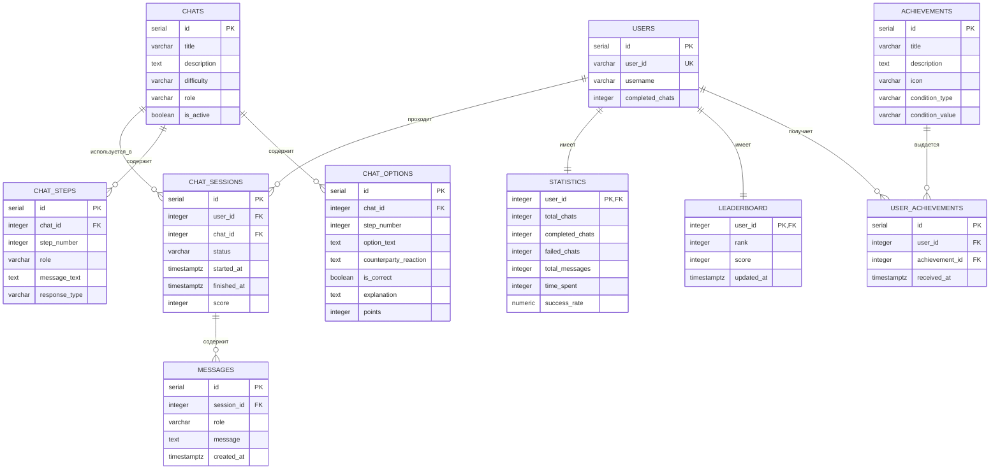
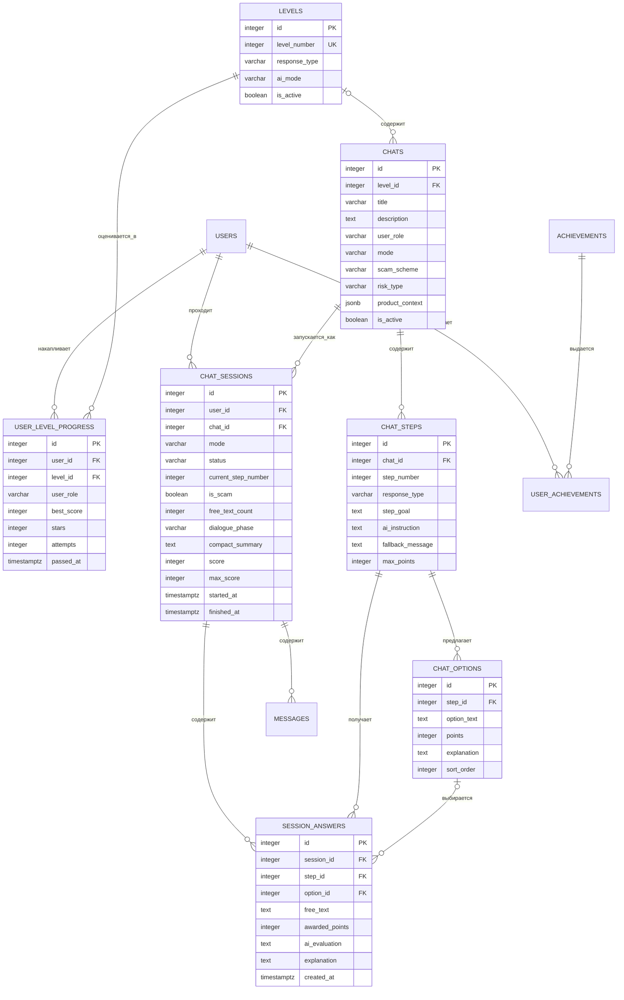

# Модель данных

## Базовая схема

Начальная versioned-миграция `backend/migrations/000001_initial_schema.up.sql` создаёт десять таблиц. Парный файл `.down.sql` удаляет их в обратном порядке.

Go-модели и CRUD сейчас существуют только для `users`, `scenarios` и `attempts`; PostgreSQL-адаптеры сохраняют исторические имена таблиц `chats` и `chat_sessions` как техническую деталь.

## Принятая целевая модель

Миграция `000002_training_model` переводит базовую схему к этой модели: добавляет уровни, отдельный прогресс по ролям, ответы внутри прохождения и корректное владение вариантами ответа. Совместимые с текущим CRUD поля `chats.role` и `chats.difficulty` временно сохранены; `user_role` дублирует `role`, когда он заполнен новой логикой.

На схеме опущены уже принятые поля `users`, `messages`, `achievements` и `user_achievements`, которые не меняют механику уровней. Для `users` целевая модель аутентификации определена ниже.

### Идентификация пользователя

Миграция `000003_local_accounts` заменила временный внешний идентификатор `users.user_id` локальной учётной записью:

- `id` остаётся внутренним ключом PostgreSQL для связей с прохождениями и прогрессом;
- `username` — обязательный уникальный логин пользователя;
- `password_hash` хранит только bcrypt-хеш пароля;
- `user_id` удаляется и не возвращается публичным API.
- `access_role` принимает `user` или `admin` и определяет доступ к тренажёру или будущей админке.

Учётные данные не должны смешиваться с ролевой веткой: покупатель и продавец — роли пользователя в тренировке, а не отдельные учётные записи.

Для MVP логин и пароль должны быть непустыми. Других ограничений длины или состава нет; уникальность логина обеспечивает база данных без учёта регистра. Перед сохранением и проверкой входа логин нормализуется к нижнему регистру.

Публичная регистрация создаёт только `user`. Единственная учётная запись с ролью `admin` создаётся при запуске из конфигурации; частичный уникальный индекс не допускает второй `admin`, а API не назначает и не изменяет роли доступа.

### Игровой цикл уровней 1–2

Миграция `000004_game_cycle_and_content` добавляет жизненный цикл Сценария (`draft`, `published`, `archived`) и четыре опубликованных стартовых Сценария: для покупателя и продавца на уровнях 1 и 2. Она также фиксирует ограничения, от которых зависит игровой цикл: один опубликованный Сценарий на пару «ролевая ветка — уровень», одно незавершённое Прохождение на пару «Пользователь — Сценарий», один Ответ пользователя на Шаг сценария, устойчивый порядок Шагов и вариантов и допустимые значения качества варианта 0, 25, 50, 75 или 100.

### Полный игровой цикл MVP

Миграция `000005_full_mvp` добавляет к Сценарию системную AI-инструкцию и итоговую рубрику, таблицу `free_play_configs` с контекстом каждой ролевой ветки, к Прохождению — ролевую ветку, счётчик свободных Ответов пользователя и итоговый JSON-разбор, а к ответу — номер хода. `step_id` допускает `NULL` только для Свободной игры, которая не привязана к Сценарию. Уникальность `(session_id, turn_number)` сохраняет порядок и допускает несколько свободных ответов на одном Шаге сценария Уровня 4.

Для одной пары «Пользователь — ролевая ветка» может существовать только одна незавершённая Свободная игра. Скрытый `is_scam` хранится в Прохождении, не входит в незавершённый GameState и раскрывается только в Result. Выбранный при старте ключ разрешённого товарного контекста хранится служебным префиксом `compact_summary` и сохраняется при последующем уплотнении истории; отдельная миграция для этого не нужна. Восемь опубликованных Сценариев миграции 5 покрывали buyer/seller × Уровни 1–4; AI-инструкции, fallback-реплики и рубрики остаются управляемым контентом.

### Полный контракт 11 экранов

Миграция `000006_frontend_contract` добавляет `topics`, `theory_blocks`, `quiz_questions`, `quiz_options`, `quiz_attempts`, `user_topic_progress`, `daily_activity` и `attempt_results`. Существующие восемь Сценариев и Прогресс связываются с ближайшей первой Темой соответствующей роли; историческая запись не копируется в остальные Темы. Seed содержит ровно 12 опубликованных Тем, 60 блоков Теории, 60 вопросов Quiz, 240 вариантов Quiz и 48 опубликованных Сценариев.

`users.training_role` хранит только предпочтительную ролевую ветку. `current_streak`, `longest_streak` и `last_activity_date` обновляются при первой учебной активности календарного дня `Europe/Moscow`; уникальность `daily_activity(user_id, activity_date)` исключает повторный день.

Каждый Сценарий имеет `topic_id`, а опубликованный контент уникален по `(topic_id, level_id)`. Каждый Шаг сценария имеет интерфейсное `counterparty_message`; внутренний `step_goal` не входит в GameState. Прогресс Уровня уникален по `(user_id, topic_id, level_id)`. `attempt_results` хранит неизменный JSON Result завершённого Прохождения.

### Управляемые Темы и Задание дня

Миграция `000007_content_daily_tasks` заменяет флаг публикации Темы lifecycle-полем `content_status` со значениями `draft`, `published`, `archived` и временем архивации. Частичный индекс гарантирует единственную опубликованную позицию 1–6 внутри ролевой ветки; `slug` остаётся уникальным. Дочерние `theory_blocks`, `quiz_questions` и `quiz_options` изменяются только через черновую Тему. Архивация логическая и не удаляет связи с историческим Прогрессом, Quiz attempts, Прохождениями и Results.

Миграция `000008_standalone_daily_tasks` заменяет техническое назначение самостоятельным Ежедневным заданием. `daily_tasks` хранит один Снимок диалога на ключ `(user_id, activity_date)`: случайную Ролевую ветку, скрытый вердикт, признаки риска или безопасности, безопасное действие и единственный окончательный Ответ пользователя. Дата определяется по `Europe/Moscow`; ответ и обновление Серии дней сохраняются в одной PostgreSQL-транзакции. AI получает только Учебный профиль (предпочтительную ветку, статусы Тем, лучшие Quiz и недавние завершённые Прохождения); при любой ошибке используется курируемый резервный Снимок.

Миграция `000009_avito_scenarios_ai` архивирует десять заменяемых шаблонных Сценариев, не удаляя их и исторические Прохождения, и создаёт десять опубликованных подготовленных замен. Остальные 38 опубликованных Сценариев сохраняются. `chat_options.counterparty_reaction` хранит необязательную реплику после выбора; `chat_sessions.dialogue_phase` и `compact_summary` делают шестиходовый генеративный диалог восстанавливаемым. Ограничение `free_text_count` расширено до шести.

Миграция `000010_complete_avito_curriculum` завершает замену seed-контента: обновляет пять блоков Теории и пять вопросов Quiz каждой из 12 Тем, архивирует 48 ранее опубликованных seed-Сценариев и публикует 48 подготовленных Avito-Сценариев. Пользовательский опубликованный Сценарий не считается seed и не заменяется. Старые записи не удаляются и остаются доступны историческим Прохождениям; использованная замена при rollback также сохраняется архивной. Точный состав Теории, Quiz, Сценариев и Свободной игры закреплён acceptance-digest.

Миграция `000011_product_context_and_risk_type` переводит каждый опубликованный Сценарий и конфигурацию Свободной игры на типизированный товарный контекст (`item_title`, `category`, `deal_method`, необязательные цена, валюта, локация и локальный `image_key`) и нормализованный `risk_type`. Она также приводит Уровень 4 к пяти Шагам. Поэтому актуальная форма Уровней — 3/2/3/5 Шагов; Уровень 3 содержит один готовый выбор и два свободных Ответа пользователя.

Миграция `000012_stable_dashboard_recommendations` хранит выбранный `continue_action` по ключу `(user_id, activity_date, user_role)`. Рекомендация остаётся устойчивой в течение всей московской календарной даты, включая обновление страницы и выполненные за день учебные действия, и пересчитывается для следующей даты.

Миграция `000013_user_reply_options` заменяет описания действий в готовых вариантах Уровней 1–3 на прямые реплики Пользователя от первого лица. `chat_options.option_text` теперь одновременно является отправляемым Ответом пользователя и текстом его Сообщения в истории. Rollback восстанавливает точные прежние формулировки из snapshot-таблицы миграции.

Миграция `000014_step_specific_user_replies` устраняет повторение готовых реплик между Шагами одной Темы. В каждой Теме 18 вариантов Уровней 1–3 имеют разные формулировки: они относятся к открытию диалога, опасной просьбе или давлению текущего Шага. Клиент позволяет выбрать и проверить готовую реплику перед отправкой; это интерфейсное подтверждение не меняет `chat_options` и контракт Ответа пользователя.

Миграция `000016_polished_demo_dialogues` заменяет опубликованные штатные Сценарии `issue-103-complete` новыми версиями: убирает механические префиксы из готовых Ответов пользователя Уровней 2–3 и заменяет универсальные реакции Виртуального собеседника на тематические реплики для всех 12 Тем. Прежние Сценарии архивируются, поэтому уже начатые Прохождения продолжают использовать исходный контент; пользовательские Сценарии и исторические Сообщения не меняются. Rollback удаляет неиспользованные новые версии, сохраняет использованные архивными и восстанавливает прежние опубликованные Сценарии.

### Режимы уровней

| Уровень | `response_type` | `ai_mode` |
| --- | --- | --- |
| 1 | `multiple_choice` | `disabled` |
| 2 | `similar_choice` | `disabled` |
| 3 | первый `multiple_choice`, затем два `free_text` | `evaluate` |
| 4 | `free_text` | `generate` + `evaluate` |

Свободная игра не является записью пятого уровня. Она запускается как отдельный режим сессии. Поле `is_scam` для такой сессии выбирается при старте и после этого не изменяется.

### Режимы прохождения

- `scenario` — прохождение сценария; `chat_id` обязателен.
- `free_play` — свободная игра; `chat_id` отсутствует, потому что она не привязана к готовому шаблону.

Статус прохождения принимает одно из значений `IN_PROGRESS`, `COMPLETED` или `ABANDONED`. Только незавершённое прохождение может перейти в один из финальных статусов; правило перехода реализовано как чистое правило домена и вызывается сервисом прохождений. Для свободной игры `is_scam` обязателен и после старта не изменяется; для сценарного прохождения он отсутствует.

### Правила целевой модели

- `chat_options` принадлежит конкретному `chat_step` через `step_id`.
- `chat_options.counterparty_reaction` необязателен; его отсутствие не создаёт пустое Сообщение.
- `session_answers` хранит результат шага: либо `option_id`, либо `free_text`.
- В уровнях 1–2 качество варианта ответа выражается только полем `points`: допустимы 0, 25, 50, 75 или 100. Бинарная правильность варианта и ответа не хранится.
- Пара `(session_id, step_id)` в `session_answers` уникальна.
- Пара `(chat_id, step_number)` в `chat_steps` уникальна.
- Пара `(step_id, sort_order)` в `chat_options` уникальна.
- Прогресс уникален по тройке `(user_id, topic_id, level_id)`; роль однозначно задаётся Темой.
- Лучшие звёзды не уменьшаются после неудачного повторного прохождения.
- `is_locked` не хранится: доступ вычисляется по прогрессу предыдущего уровня в той же ролевой ветке.
- Физические таблицы статистики и рейтинга не нужны для MVP; значения можно вычислять из прохождений и прогресса.
- Роль пользователя ограничена `buyer` и `seller`; тип ответа — `multiple_choice`, `similar_choice`, `mixed` или `free_text`. Evaluator и детерминированный generator независимы, а сервер владеет фазой, Баллами и завершением.
- Звёзды назначаются от итогового балла: одна — от 55, две — от 70, три — от 85.

## Инварианты, уже выраженные в SQL

- `users.username` уникален после нормализации к нижнему регистру, а `access_role='admin'` возможен только у одной учётной записи;
- номер шага уникален внутри сценария;
- пользователь не может дважды получить одно достижение;
- прохождение сценария ссылается на существующих пользователя и сценарий, а свободная игра — только на пользователя;
- сообщения удаляются вместе с сессией.

Индекс `chat_options(chat_id, step_number)` не уникален: один шаг сценария может иметь несколько вариантов ответа. В целевой модели варианты будут связаны с `chat_steps` через `step_id`.

История изменения лучшего прогресса пока не хранится отдельно: для MVP достаточно текущего лучшего результата и сохранённых прохождений.

## Адаптивное обучение

`mistake_pattern_events` хранит только нормализованный код паттерна, ссылку на завершённое Прохождение, Ролевую ветку и безопасный/рискованный результат. В нём нет Сообщений или свободного текста. Устойчивость определяется детерминированно: два рискованных совпадения среди последних пяти Прохождений либо три за всё время; два безопасных совпадения уменьшают приоритет.

`skill_check_pairs` хранит подготовленные обезличенные пары Снимков диалога для Темы, а `skill_checks` — выбранную сервером пару и два бинарных вердикта Пользователя. Эти таблицы не ссылаются на Result, Прогресс или ежедневную активность.
